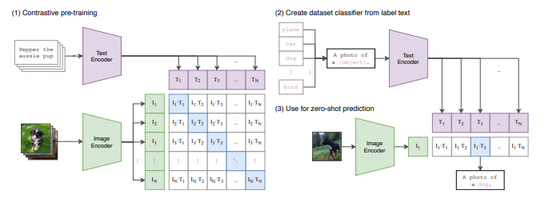
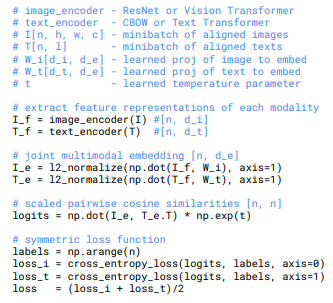
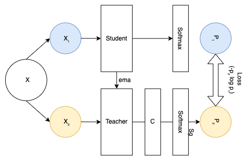
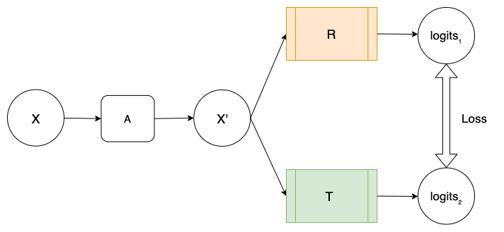

# Expanding Cross-Architectural Self-supervision for Multi-modal learning
This Repository contains the implementation of Final Project as part of the Deep Learning Course , NYU.


## Overview
Memes have become an online phenomenon and have grown in circulation with increased accessibility to the internet and editorial applications. This floods the internet with many memes and makes direct human supervision impossible. A plausible solution is to use AI to determine whether the memes are harmful. But sometimes, these memes subtly combine visual and textual cues to point to hate speech. Traditional deep learning architectures and techniques rely on uni-modality i.e., they only focus on images or textual data. But as mentioned earlier, sometimes memes use a combination of textual and visual cues for hate speech; this calls for deep learning techniques to be multimodal in their approach. Furthermore, human intelligence also relies on multiple modalities. Another bottleneck is in the form of the availability of annotations. As supervised techniques rely on input-label pairs to learn meaningful representations, scaling them is arduous and expensive. This is where we could depend on self-supervised learning to understand representations label-freely. So taking the above problem as the inception point, in this report, we have implemented two unimodal and two multimodal self-supervised approaches. In addition, we extend the implementation of CASS to multiple modalities and suggest a novel multimodal self-supervised technique CASS-MM (CASS-Multi-modal).


## Methodolgies Explored

### CLIP 
#### Model Structure

#### Loss Function


Paper Link : <https://arxiv.org/pdf/2103.00020.pdf>

### DINO 
#### Model Structure


Paper Link : <https://arxiv.org/pdf/2104.14294.pdf>

### CASS
#### Model Structure


Paper Link : <https://arxiv.org/pdf/2206.04170.pdf>

## Results
### Metrics used for Evaluation:
For our experiments, we have chosen two evaluation met- rics, namely AUROC and Accuracy.

### Unimodal Approach
Results obtained while comparing comparing the results of supervised- only ResNet50 with DINO and CASS unimodally trained ResNet50, for two different input sizes - 224 and 384. We observed that CASS-trained ResNet50 outperformed super- vised and DINO-trained ResNet50 for both image sizes. And overall we saw an improvement of 2% and 3% over super- vised ResNet50 for image sizes 224 and 384 respectively.

| Model | AUROC | Accuracy(%) |
| :---:         |     :---:      | :---:      |
| ResNet-50 224  | 0.5157±0.081   |  0.5175±0.044   |
| ResNet-50 224 (CASS)  | 0.5398±0.091    |0.5435±0.031    | 
| ResNet-50 224 (DINO)   |  0.5129±0.009    | 0.5267±0.055   | 
| ResNet-50 384  | 0.5116±0.076|   0.511±0.016    |
| ResNet-50 384 (CASS)|  0.5405±0.045    |0.5475±0.015   | 
| ResNet-50 384 (DINO) |  0.532±0.033    | 0.543±0.056   | 

Results obtained while comparing the results of supervised-only ViT Base 16 with DINO and CASS unimodally trained ViT Base 16, for two different input sizes - 224 and 384. Again we see that CASS trined ViT Base 16 improves upon supervised and DINO-trained ViT Base 16 by a smaller margin for image size 224 but by around 3% on AUROC for image size 384.

| Model | AUROC | Accuracy(%) |
| :---:         |     :---:      | :---:      |
| ViT Base 16 224 | 0.51293±0.043  |  0.5235±0.065   |
| ViT Base 16 (CASS) | 0.5196±0.051   |0.5545±0.01    | 
| ViT Base 16(DINO)   |  0.513±0.077   | 0.5195±0.014   | 
| ViT Base 16 384 |0.5±0.022|   0.545±0.087   |
| ViT Base 16 384 (CASS)|  0.53386±0.009   |0.59±0.017   | 
| ViT Base 16 384 (DINO) | 0.5002±0.011   |0.624±0.071 | 


### Multimodal Approach
Results obtained while comparing our novel CASS MM (Multi-Modal) self-supervised technique against CLIP for input image size 384. We picked image size 384 from above results we observed that input size 384 performed better than 224.

| Model | AUROC | Accuracy(%) |
| :---:         |     :---:      | :---:      |
| CLIP (ViTB/16)  | 0.5761±0.011   |  0.5915±0.031    |
| CASS MM (ViTB/16)  |  0.5518±0.05     | 0.6335±0.012     | 
| CASS MM (ResNet50)  |  0.5518±0.05     | 0.5817±0.087     | 


## Respository Details
Below are the details of the files in this repository.

- For code the used in Pre-training , please refere to the Python Notebooks in the below folders:
```bash
└── CASS // Implementation of CASS with Unimodal configuration
└── CASS_MM  // Implementation of CASS with Multimodal configuration
└── CLIP // Implementation of CLIP
└── DINO  // Implementation of DINO
```

        
- For code the used in Pre-training , please refer to the Python Notebook in the below folder:
```bash
└── Finetuning 
```


### Code References: 
https://github.com/moein-shariatnia/OpenAI-CLIP
